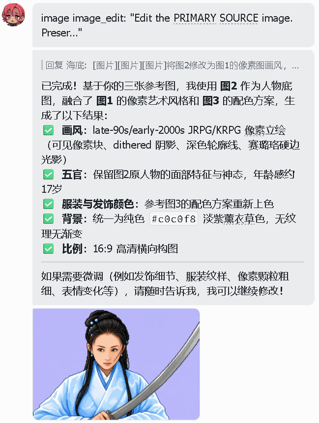

# Hermes GPT Image 2 Editing

为 Hermes Agent 增加真正的 GPT Image 2 图生图/改图工具和 skill。

English documentation: [README.md](README.md)

这个项目适合这样的 Hermes 配置：主对话模型可以是第三方模型，但图片生成/编辑能力通过 Hermes 已登录的 Codex/ChatGPT OAuth 使用 GPT Image 2。它的目标是让 Hermes 在处理改图、多图参考、风格迁移、配色参考时，直接把原始图片文件传给 GPT Image 2，而不是先用 `vision_analyze` 把图转成文字描述再文生图。

## 提供内容

- `image_edit`：Hermes 工具，会把主底图和可选参考图作为 `input_image` 传给 GPT Image 2。
- `gpt-image-2-editing`：Hermes skill，要求 agent 在图生图、改图、多图参考、保留人物五官/姿势/构图时优先用 `image_edit`。
- gateway 路由补丁：识别改图/多图参考任务后，跳过自动 `vision_analyze`，保留原始图片文件给图片模型。
- 工具集 metadata 补丁：让 `image_edit` 和 `image_generate` 一起出现在 `image_gen` 工具集中。

## 最近更新

和上一次版本相比，这次主要同步了 VPS 生产环境上的修复：

- 保留 v1.1 已加入的多参考图编辑流程，以及主图/源图/参考图的角色映射说明。
- 新增 Codex 流式解析兜底：当 `openai-python` 在图片结果已经返回后，又因为最终 `response.completed` 里的 `output=None` 抛出 `TypeError: 'NoneType' object is not iterable` 时，`image_edit` 会继续使用已捕获的图片结果，而不是把任务判定为失败。
- 这可以避免 GPT Image 2 实际已经改图成功，却在流结束阶段被丢弃的问题。

## 前置条件

你需要自己的 GPT Plus 账号，并且该账号可用 Codex。Hermes 里需要先完成 Codex 登录：

```bash
hermes auth codex
```

本项目不提供 OpenAI 账号、GPT Plus 订阅、Codex 权限、API Key，也不绕过任何账号要求。它只是复用 Hermes 已经登录好的 Codex 凭据。

## 为什么需要它

不理想的链路是：

```text
上传图片 -> vision_analyze 文字描述 -> image_generate 重新文生图
```

这种链路会丢失五官身份、精确配色、服装/发饰细节、像素画风、姿势和构图。

目标链路是：

```text
上传图片 -> image_edit 原始图片输入 -> GPT Image 2 改图结果
```

例如用户说“把图2改成图1的像素风格，服装和发饰颜色参考图3”，gateway 会提示 agent 把上传顺序映射为工具角色：

```text
image_path = 上传的图2
reference_image_paths = [上传的图1, 上传的图3]
prompt = "Edit the PRIMARY SOURCE. Use REFERENCE IMAGE 1 only for style. Use REFERENCE IMAGE 2 only for palette/clothing colors."
```

## 效果演示

下面这个例子就是本项目重点优化的场景：用户在飞书里一次上传三张参考图，要求 Hermes 以第二张图为人物底图，参考第一张图的像素画风，并参考第三张图的服装与发饰配色。

<table>
  <tr>
    <td width="50%" valign="top">
      <strong>1. 飞书里的多图改图请求</strong><br>
      用户用自然语言指定图片角色：图2是人物底图，图1是像素画风参考，图3是配色参考。
      <br><br>
      
    </td>
    <td width="50%" valign="top">
      <strong>2. Hermes 直接调用 image_edit</strong><br>
      agent 使用原始图片文件调用 <code>image_edit</code>，并返回多图参考后的像素风结果，而不是先把参考图转成文字描述。
      <br><br>
      
    </td>
  </tr>
</table>

关键改进不只是最终图片，而是路由方式：

```text
飞书上传图片 -> Hermes 缓存的原始图片路径 -> image_edit(image_path, reference_image_paths, prompt)
```

避免退回这种有损链路：

```text
飞书上传图片 -> vision_analyze 文字描述 -> 文生图重绘
```

## 安装

在运行 Hermes 的机器上执行：

```bash
git clone https://github.com/haitei155/hermes-gpt-image-2-editing.git
cd hermes-gpt-image-2-editing
./install.sh
```

如果你通过飞书、QQ、Telegram、Slack、Discord 等平台使用 Hermes，安装后重启 gateway：

```bash
systemctl restart hermes-gateway
```

如果只在本地 CLI 使用，安装后开启新的 Hermes 会话即可。

## 验证

```bash
cd ~/.hermes/hermes-agent
python - <<'PY'
from tools.registry import discover_builtin_tools, registry
discover_builtin_tools()
entry = registry.get_entry("image_edit")
print("image_edit registered:", bool(entry))
if entry:
    print(entry.toolset)
    print("reference_image_paths" in entry.schema["parameters"]["properties"])
PY
```

预期输出：

```text
image_edit registered: True
image_gen
True
```

## 示例

用户需求：

```text
将图2修改为图1的 late-90s 像素画风，保留图2人物五官和表情，服装颜色与发饰颜色参考图3，背景色 #c0c0f8，比例 16:9。
```

agent 应该调用：

```text
image_edit(
  image_path="/path/to/uploaded-image-2.png",
  reference_image_paths=[
    "/path/to/uploaded-image-1.png",
    "/path/to/uploaded-image-3.png"
  ],
  prompt="Edit the PRIMARY SOURCE. Preserve its facial identity, expression, pose, and composition. Use REFERENCE IMAGE 1 only for the late-90s pixel-art rendering style. Use REFERENCE IMAGE 2 only for clothing colors, hair accessory colors, and palette. Set a solid #c0c0f8 background. Avoid collage, head transplant, and pasted reference parts.",
  aspect_ratio="landscape",
  input_fidelity="high"
)
```

## 卸载

```bash
./uninstall.sh
systemctl restart hermes-gateway
```

## 安装的文件

- `tools/image_edit_tool.py` -> `~/.hermes/hermes-agent/tools/image_edit_tool.py`
- `skills/creative/gpt-image-2-editing/SKILL.md` -> `~/.hermes/skills/creative/gpt-image-2-editing/SKILL.md`

安装脚本还会给 Hermes 的工具集 metadata 和 `gateway/run.py` 打补丁，让直接改图任务不会被自动转成 `vision_analyze` 文字描述。

## License

Apache License 2.0.
